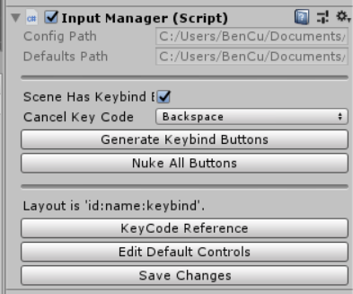

# CustomInputManager Quick Start Guide

Welcome to CustomInputManager! This simple guide will get you started on a simple project, with several custom keybinds and a menu where your user can create their own configurations!

### Step One: Download

You can download the latest release [here](https://github.com/dbqeo/UnityInputManager/releases). Open the Unity package in your project, and follow the instructions in the popup dialog box to import the code in.

### Step Two: Configuration

Upon import, a folder named 'CustomInputManager' will be created. In order to add the Input Manager to your scene, add 'Scenes/InputManager.cs' into any object that will not be cloned or destroyed.

Select the object to view the custom Inspector controls for the InputManager script. Here, you can open the default configuration file for editing (it will open the file in your default code editor). 



In the default configuration file, each line corresponds to one custom keybind. The format for each line is `ID:Name:KeyCode`. 
 - ID: Numerical identifier, can be any non-negative number. Each keybind must have a unique ID. The ID is for internal bookkeeping purposes but can also be accessed through the API. 
 - Name: General identifier for the keybind. This is the name that will display on auto-generated keybind buttons, and the name that will be used through the API to get key inputs.
 - KeyCode: Default key input that corresponds to this keybind. You may reference the [Unity API page](https://docs.unity3d.com/ScriptReference/KeyCode.html) for a full list of valid keybinds. This is only for the default configuration, and can be reassigned by the user.

 After editing the configuration file, remember to click the "Save Configuration" button in the Inspector to update the database before generating keybind buttons.

 ### Step Three: Generating Keybind Buttons
 
 In your Main Menu or Options scene where you want to insert keybind buttons for users to assign custom configurations, add the InputManager script and the TemplateButton prefab. Additionally, create a Text object titled "InfoText." This will be displayed during keybind assignment to let the user know that they are currently in keybind selection mode, and how to cancel it. There is no need to edit the text content; it will be automatically assigned in script.
 
 In the Inspector Panel, check the toggle box for "Scene Has Keybind Buttons." This will reveal further options:
  - Cancel Keybind: What key the user should press if they are in keybind selection mode and do not wish to edit the keybind. This will be displayed in the InfoText.
  - Generate Keybind Buttons: This will generate buttons underneath where you placed the TemplateButton. Each will already have the correct title and ID assigned, so the only thing to do is rearrange them wherever you wish. If you want to change the button style, font, etc. you may change them in the TemplateButton and the changes will be reflected in all generated buttons.
  - Nuke All Buttons: Removes all generated buttons. Click this when you wish to regenerate buttons after you edit the default configuration, or the TemplateButton.

### Step Four: Use API In Your Scripts

The InputManager API is very similar to default unity Input interface, with the difference that it is a nonstatic class. Therefore, you can initialize InputManager using the static convenience method in InputManager, `InputManager.GetInputManager()`.

```csharp
private InputManager input;

...

void Start () {
    input = InputManager.GetInputManager();
}
```

The API is very similar to the default Input, and currently includes the following methods:
- `static GetInputManager() : InputManager` Returns the InputManager object in the current scene. Throws a `NullReferenceException` if no InputManager is found.
 - `GetKey(string name) : bool` Returns true if the custom keybind with given name is currently pressed down.
 - `GetKeyDown(string name) : bool` Returns true on initial key press.
 - `GetKeyUp(string name) : bool` Returns true when the key is released.
 - `GetKeyCode(string name) : string`  Returns the KeyCode corresponding to the keybind with given name.
 - `GetKeyCode(int id) : string`  Returns the KeyCode corresponding to the keybind with given ID.
 - `ResetControls() : void` Copies default configuration to user configuration.

Axes and controller support will be added in the next major update.